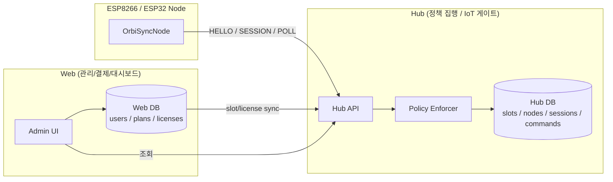

# OrbiSyncNode

**OrbiSyncNode**는 ESP8266 / ESP32 기반 디바이스를 위한  
**Hub 중심 · 세션 기반 · RAM-only 인증 IoT 노드 라이브러리**입니다.

이 라이브러리는 디바이스를 **신뢰하지 않는(Zero-Trust)** 구조를 따르며,  
모든 인증 · 슬롯 정책 · 제어 · 명령 처리는 **Hub가 책임**집니다.

디바이스에는 **영구 토큰/키를 절대 저장하지 않습니다.**

---

# ✨ Key Features

## 🔒 RAM-only Session
- Flash / EEPROM 저장 없음
- 토큰은 RAM에만 존재
- 재부팅 시 자동 로그아웃 (보안 ↑)

## 🔁 Hub-centered Authorization
- Node는 Hub에만 통신
- Web UI는 Hub DB만 조회/관리
- Node ↔ Web 직접 통신 없음

## 🧠 Explicit State Machine

```
BOOT → HELLO → PENDING_POLL → ACTIVE → ERROR
```

디버깅/운영이 매우 쉬움

## 🌐 HTTP/HTTPS + WebSocket Tunnel
- 기본: HTTP Polling
- 옵션: WebSocket 터널
- NAT/방화벽 환경에서도 안정적

---

# 🧩 Architecture Overview

> Web은 관리/결제/대시보드 역할  
> Hub는 정책/인증/슬롯관리/명령중계 역할  
> Node는 세션 참여자 역할



---

# 🧭 Protocol Timeline

⚠️ 중요  
`(heartbeat + command pull)`은 **Node가 추가 요청을 보내는 것이 아닙니다.**  
Hub가 `/session` 요청 내부에서 **last_seen 갱신 + 명령 조회를 동시에 처리**한다는 의미입니다.

```text
시간 →
Arduino(Node)                    Hub                                        Web(UI)
     |                             |                                          |
     |--- HELLO(slot_id, mac) ---->|                                          |
     |                             |-- check slot policy (max_nodes, status)  |
     |                             |-- calc used_nodes (active + last_seen)   |
     |<-- GRANTED(token, ttl) -----|  (used < max && active license)          |
     |                             |                                          |
     |--- POLL_SESSION(token) ---->|                                          |
     |<-- SESSION_OK + cmds/empty -|  (heartbeat + command pull)              |
     |--- POLL_SESSION ----------->|                                          |
     |<-- SESSION_OK + events -----|                                          |
     |--- POLL_SESSION ----------->|                                          |
     |<-- SESSION_OK --------------|                                          |
     |                             |-- update last_seen / node state          |
     |                             |                                          |
     |                             |<---------- GET /slots -------------------|  (웹 화면 로딩)
     |                             |---------- slots summary ---------------->|
     |                             |<---------- GET /nodes?slot=... ----------|
     |                             |---------- nodes list ------------------->|
     |                             |                                          |
     ----- 가입/업그레이드/다운그레이드 발생 ------------------------------------------
     |                             |<--- POST /slots/update(slot,max,ver) ----|  (웹→허브 즉시 반영)
     |                             |    (Hub DB: max_nodes/status/version)    |
     |                             |--- 200 OK ------------------------------>|
     |                             |                                          |
  ----- 슬롯 초과 시 ---------------------------------------------------------------
     |--- HELLO(slot_id, mac) ---->|                                          |
     |<-- DENIED(FULL, retry_after)|  (used >= max OR suspended)              |
     |--- (backoff) -------------->|                                          |
     |--- HELLO(retry) ----------->|                                          |
     |<-- DENIED(FULL) -----------|                                           |
```


## Device Pairing & Session Flow ⭐ (상세 흐름)
HELLO → PENDING → POLL → GRANTED
토큰 발급 과정 상세
(지금 만든 다이어그램)
시간 →
Node                    Hub                       Web(UI)
   |                       |                         |
   |--- HELLO ------------>|                         |
   |<-- PENDING -----------|  /api/sessions/approve  |                    |
   |                       |---- handshake --------->|
   |                       |                         |-- token 생성
   |                       |<------------------------|
   |                       |   (token ready)         |
   |                       |                         |
   |--- POLL ------------->|                         |
   |<-- GRANTED(token) ----|                         |


POST /api/sessions/approve
Headers
Authorization: Bearer {admin_token}
Content-Type: application/json

Body
{
  "node_id": "node-esp32-001",
  "slot_id": "slot-A1",
  "ttl": 3600,
  "capabilities": ["heartbeat", "commands", "tunnel"],
  "metadata": {
    "name": "회의실 도어락",
    "location": "3층 A룸"
  }
}

🔹 파라미터 설명
필드	타입	필수	설명
node_id	string	✅	HELLO에서 온 노드 ID
slot_id	string	❌	할당 슬롯
ttl	int	❌	세션 유효시간 (초)
capabilities	array	❌	허용 기능
metadata	object	❌	UI 표시용 정보


✅ Hub 내부 동작

handshake 호출 시:

Hub가 수행할 일
1. node pending 상태 확인
2. 세션 생성
3. token 발급 (JWT or random)
4. DB 저장
5. status → APPROVED 변경
6. 다음 poll 시 GRANTED 응답

✅ Response 정의
성공 (200)
{
  "status": "approved",
  "node_id": "node-esp32-001",
  "session": {
    "token": "eyJhbGciOiJIUzI1NiIsInR5cCI6IkpXVCJ9...",
    "expires_at": "2026-02-01T18:20:00Z",
    "ttl": 3600,
    "tunnel_url": "wss://hub.orbisync.io/ws/node-esp32-001"
  }
}

실패 케이스
노드 없음
404
{
  "error": "node_not_found"
}

이미 승인됨
409
{
  "error": "already_active"
}

권한 없음
401
{
  "error": "unauthorized"
}


✅ Node 쪽 흐름 연결

Node는 handshake를 직접 호출하지 않음
👉 계속 pollSession()만 수행

Hub → Node 응답:

아직 미승인
{
  "status": "pending"
}

승인 완료
{
  "status": "granted",
  "token": "xxxxx",
  "ttl": 3600,
  "tunnel_url": "wss://..."
}


이때:

state = ACTIVE
WebSocket 연결 시작
---

# 🔁 State Machine

| State | 설명 |
|-------|------------------------------|
| BOOT | 초기화 |
| HELLO | Hub에 접속 요청 |
| PENDING_POLL | 승인 대기 |
| ACTIVE | 정상 운영 |
| ERROR | 네트워크/인증 실패 |

---

# 🚀 Quick Start (Minimal Example)

```cpp
#include <OrbiSyncNode.h>

const char* WIFI_SSID = "your_ssid";
const char* WIFI_PASS = "your_password";
const char* HUB_URL   = "https://hub.orbisync.io";
const char* SLOT_ID   = "your_slot_id";

const char* caps[] = {"heartbeat","commands"};

OrbiSyncNode::Config config = {
  .hubBaseUrl = HUB_URL,
  .slotId = SLOT_ID,
  .firmwareVersion = "1.0.0",
  .capabilities = caps,
  .capabilityCount = 2,
  .heartbeatIntervalMs = 5000,
  .ledPin = LED_BUILTIN
};

OrbiSyncNode node(config);

void setup() {
  Serial.begin(115200);
  node.beginWiFi(WIFI_SSID, WIFI_PASS);
}

void loop() {
  node.loopTick();
}
```

---

# 📦 Installation

## Arduino Library Manager
Arduino IDE → Library Manager → `OrbiSyncNode` 검색

## Manual
`libraries/OrbiSyncNode/` 폴더에 복사

---

# 🧪 Examples

- basic_smoke_test → 최소 동작 테스트
- reference/example → 전체 기능 예제

---

# 🔌 Hub API Interaction

| Endpoint | 설명 |
|------------------------------|----------------------------|
| POST /api/device/hello | 세션 요청 |
| POST /api/device/session | poll + heartbeat 의미 + 명령 조회 |
| POST /api/device/heartbeat | (옵션) 분리형 heartbeat |
| POST /api/nodes/register_by_slot | 노드 등록 |
| wss://hub/.../tunnel | 터널 |

---

# 🧠 Notes & Design Philosophy

- 디바이스는 **절대 신뢰 대상이 아님**
- 장기 토큰 / API Key 저장 금지
- 인증/정책은 Hub가 담당
- Web은 관리 전용
- Node는 세션 참여자

---

# ✅ Supported Boards

- ESP8266 (NodeMCU 등)
- ESP32

---

# 📄 License

MIT License
